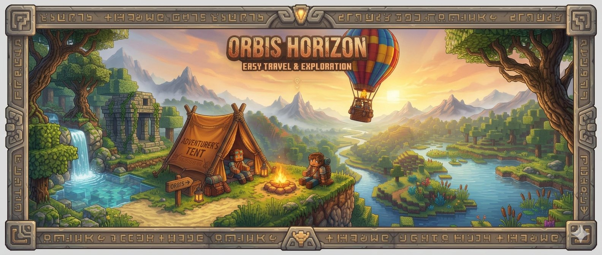

Orbis Horizon is an adventure mod for Hytale. It adds vehicles and camping gear that you craft, set up from a crate and pack away again. The mod currently contains two hot air balloons you can fly (a small one-person balloon and a large one for up to 5 people) and two camping tents (a small one and a large one). The Cloudwork airship, a large ship that turns freely, is also in the mod. Players aboard at take-off sit on its stools and tavern benches (15 seats). Its crate is crafted at a tier 3 basic workbench and needs every workbench the airship carries. More flying vehicles and more camping gear are planned.

The mod is still in development. Several features have not been tested in game yet.

## The hot air balloons

There are two balloons, the small one-person balloon and the large balloon. They work the same way. You craft a deployment crate and place it on the ground, and a hot air balloon made of blocks appears. You then pull the burner chain to take off and fly freely through the air.

### How it works in game

1. At the basic workbench, open the Tinkering tab and craft the burner, the chain and then the deployment crate. The small balloon needs a tier 2 workbench and the large one a tier 3 workbench.
2. The small balloon crate takes 16 white wool, 12 blue wool and 6 hardwood planks, plus a burner and a chain. The large balloon crate takes 72 red wool, 50 white wool, 48 hardwood planks and 12 iron bars, plus a burner and a chain. These quantities are suggestions and may change.
3. Use the secondary click to place the crate on the ground. The balloon appears in blocks, facing the player. After that it cannot be modified, so no block can be broken or added.
4. Put fuel in the burner, climb the ladder into the basket and pull the chain to take off.
5. Fly freely, moving forwards, up and down. Pull the chain again to stop the flight and set the balloon back down in blocks where it is, on the ground or in the air.

Other behaviour:

- The burner uses up its fuel while flying and while hovering in the air. When it runs dry, the balloon descends on its own until it reaches the ground.
- On the large balloon, up to 4 passengers sit on the stools during the flight. The small balloon has no seat and carries the pilot alone. With more people on board than the balloon carries, take-off is refused.
- The chests in the large balloon keep their contents during the flight. The small balloon has no chest.
- If the pilot leaves the game during a flight, the balloon is set back down in blocks.
- Operators can use the admin command `/orbishorizon balloon despawn` (or `/orbishorizon balloon remove`) to remove the nearest balloon, whether it is placed or flying. The contents of the burner and the chests drop to the ground and the admin receives the deployment crate.

## The Cloudwork airship

- Craft the engine, the fuel tank and 2 burner outlets at a tier 3 basic workbench, then the airship crate, which also needs all the workbenches the ship carries.
- Place the crate on a clear area of about 11 x 17 x 31 blocks. Put fuel in the tank, stand at the pilot spot and pull the lever to take off.
- Fly freely. The ship turns toward the direction you fly and stays in the air without fuel. It only burns fuel while it moves sideways.
- Pull the lever again to land. Players aboard at take-off are seated and set down at landing.

## The camping tent

- The "Small Tent" crate is crafted at the basic workbench (tier 1, Tinkering tab) from 40 fibre, 10 light hide, 20 sticks, a campfire and a bed. These quantities are suggestions and may change.
- A secondary click with the crate on the ground sets up the tent facing the player, with a bed, a campfire, a stool and a lantern. The tent needs enough free space, otherwise a message says so and the crate is left untouched.
- Once the tent is up, the crate in the player's hand becomes the "Small Tent (empty crate)", in the same inventory slot.
- A secondary click with the empty crate on the tent packs it away and the crate becomes full again. Only the player who set up the tent or an operator can pack it. Anything inside the campfire drops to the ground.
- While the tent is set up, it cannot be broken and no block can be placed on it. The bed and the campfire can still be used.

### The large tent

- The "Large Tent" crate is crafted at the basic workbench (tier 2, Tinkering tab) from 80 fibre, 20 light hide, 30 sticks, a campfire, 2 beds and 2 small crude chests. These quantities are suggestions and may change.
- It works like the small tent, with its own pair of crates ("Large Tent" and "Large Tent (empty crate)"). It has 2 beds, 2 chests, 2 stools, 2 candles, a campfire and a few ladders at the entrance.
- The empty crate of one tent does not fit the other tent. A message tells you so and nothing changes.
- When you pack the large tent, the contents of the campfire and of both chests drop to the ground.

## Wiki

The wiki explains how to craft, set up and fly everything in the mod, and lists the commands.

## Changelog

The changes of each version are listed in [CHANGELOG.md](CHANGELOG.md).

## Credits and sources

- The hot air balloon prefab is based on [Hot Air Ballon](https://www.curseforge.com/hytale/prefabs/hot-air-ballon). It has been modified for this mod (burner, take-off chain, ladder, removed blocks). The small balloon has its own prefab. Check the reuse terms on its page before distributing the mod.
- The tents prefab are based on [Desert Base Camp - Tent (Model 2)](https://www.curseforge.com/hytale/prefabs/desert-base-camp-tent-model-2) and [Desert Base Camp - Tent (Model 1)](https://www.curseforge.com/hytale/prefabs/desert-base-camp-tent). They have been modified for this mod (added/moved/removed blocks). Check the reuse terms on its page before distributing the mod.
- The 3D flight model and its texture are generated from the prefab using the game's block textures. These textures, and the game assets copied or adapted for the mod, belong to Hypixel Studios.

## Licence

The original code and content of this mod are licensed under the [PolyForm Noncommercial License 1.0.0](LICENSE). You can use, copy and modify them for noncommercial purposes, and commercial use is not permitted. The prefabs and the game assets listed in [NOTICE](NOTICE) are not covered by this licence.

### Terms of use for this mod in your adventures.

If you use this mod in a modpack, on your server or elsewhere, please provide the URL of this mod’s page. 
The commercial distribution of content containing all or part of this mod is prohibited.